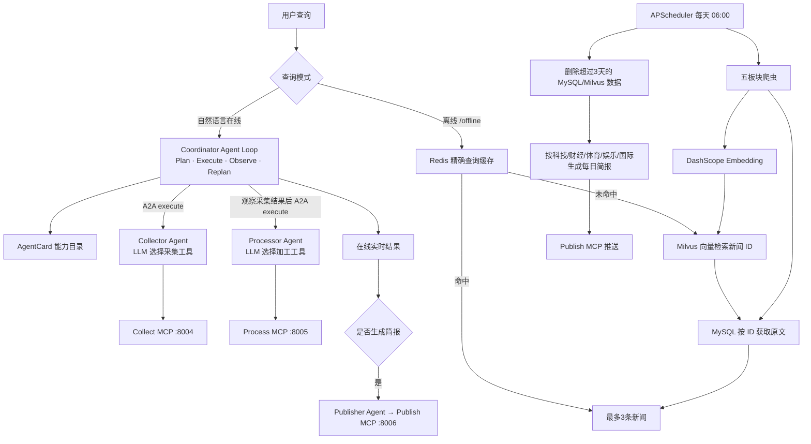

# 实时热点资讯多智能体系统 · 项目流程

> 立项架构：**A2A + MCP** 多智能体系统
> - **上游**：四类用户任务 —— 模块热点查询 / 模块最新新闻 / 账户发布查询 / 账户持续监控
> - **Agent Loop**：Coordinator 按 `Plan → Execute → Observe → Replan` 每轮只决定一个动作
> - **A2A**：Coordinator 根据 AgentCard 能力目录选择专业 Agent 并委派目标
> - **MCP**：专业 Agent 使用 LLM 从自己的工具目录选择工具，再经 MCP 网关执行
> - **离线新闻库**：每天 06:00 抓取五个板块，只保留最近 3 天；查询按 Redis → Milvus → MySQL 执行

---

## 1. 四类上游任务

| 任务 | 目标 | 流水线 |
| --- | --- | --- |
| ① 查询某模块当前热点新闻 | 模块维度的热度 Top-N | 采集(按模块) → 聚类 → 排序 → 核验 |
| ② 查询某模块最新新闻 | 模块维度的最新资讯 | 采集(按模块) → 去重 → 时间倒序 |
| ③ 查询某账户最近发布 | 一次性读取指定账户内容 | Coordinator → CollectorAgent → Collect MCP |
| ④ 持续监控某账户 | 注册、定时增量检查、视频转写、入库通知 | Coordinator → AccountMonitorAgent → 监控服务/Video MCP |

> **模块** = 新闻分类维度（如 科技 / 财经 / 体育…），按部署配置；
> **账户** = 需关注的资讯 / 作品发布源（媒体号、KOL 等）。

## 2. 整体流程（在线多 Agent + 离线新闻库）



### 双入口模式

| 入口 | 调用路径 | 特点 |
| --- | --- | --- |
| 对话入口（自主 Agent） | 用户自然语言 → Coordinator 单步规划循环 → 专业 Agent 工具选择 → MCP | 每一步都读取真实观察后再决定下一步 |
| 操作入口（确定性） | `/hotspot`、`/monitor`、前端功能直选等 → 现有 `run_*` | 快、可预测，适合明确命令与运维操作 |

`task_pipelines` 与 Coordinator 的原 `run_*` 保留为确定性操作入口及 Agent Runtime 故障回退，
不再承担自然语言主路由。

## 3. A2A 协作流程（简报反问确认）

```
任务流水线完成 → 输出优化 Agent 呈现结果
  → 经 A2A 向简报生成 Agent 发起交接（handoff）
  → 简报 Agent 反问用户："是否要生成简报推送？"
       ├─ 是 → 生成简报（摘要 · 重要性 · 来源 · 可信度）→ Publish MCP 推送
       └─ 否 → 流程结束
```

- **A2A 实现**：协议类型（`Message` / `MessageRole` / `AgentCard` / `A2AServer`）来自官方包 **python_a2a**；`a2a/protocol.py` 只是便捷封装（`send_task` 委派 / `parse_task` 解析 / `delegate` 交接 / `reply_text` 回传 / `ask_user_confirm` 反问）

## 4. 任务流水线详情

### 任务① 模块热点新闻查询（`task_pipelines/hotspot_query_pipeline.py`）

```
实时资讯采集 Agent ─→ 原始资讯库 ─→ 事件聚类 Agent ─→ 事件聚类库(pgvector)
    → 热点排序 Agent → 热点事件库 → 多源核验 Agent → 核验结论
    → 输出优化 → 展示 → [简报交接]
```

### 任务② 模块最新新闻查询（`task_pipelines/latest_news_pipeline.py`）

```
实时资讯采集 Agent(按模块) → 去重 → 按时间倒序排列 → 输出优化 → 展示 → [简报交接]
```

### 任务③ 账户发布关注（`task_pipelines/account_follow_pipeline.py`）

```
账户监控 Agent(轮询拉取) → 新发布过滤 → 输出优化 → 展示 → [简报交接]
支持 scheduler 定时轮询，长期订阅模式
```

## 5. 目录结构与框架对应关系

```
HotnewsFeed/
├── a2a/                          # A2A 适配层（协议类型来自官方包 python_a2a）
│   └── protocol.py               # send_task / parse_task / delegate / reply_text / ask_user_confirm
│
├── agents/                       # 多智能体层（均直接继承 A2AServer + 标准 AgentCard）
│   ├── coordinator_agent.py      # 自然语言入口：自主循环优先，固定 run_* 仅作操作入口/故障回退
│   ├── llm_dispatch_agent.py     # :8010 兼容 A2A 外壳，复用同一个 CoordinatorLoop
│   ├── runtime/                  # 自主 Agent 运行时
│   │   ├── schemas.py            # Action / Observation / AgentRunResult 统一协议
│   │   ├── agent_catalog.py      # 从 AgentCard 构建机器可读能力与工具目录
│   │   ├── coordinator_loop.py   # 单步 Plan→Execute→Observe→Replan 循环
│   │   ├── specialist_loop.py    # 专业 Agent 的 LLM 工具选择器
│   │   └── policy.py             # 可调用能力与副作用动作安全边界
│   ├── collector_agent.py        # 采集 Agent：多源采集 · 账户监控
│   ├── processor_agent.py        # 加工 Agent：聚类 · 热度 · 核验（任务①）
│   ├── publisher_agent.py        # 输出 Agent：优化呈现 · 简报推送（A2A 交接后调用）
│   └── account_monitor_agent.py   # 账户监控 Agent：注册 · 检查 · 状态 · 停止（A2A :8009）
│
├── task_pipelines/               # 底层功能层：协调器调用 + 前端功能直选共用
│   ├── hotspot_query_pipeline.py # ① 查询某模块热点新闻
│   ├── latest_news_pipeline.py   # ② 查询某模块最新新闻
│   └── account_follow_pipeline.py# ③ 关注某账户新闻/作品发布
│
├── mcp_servers/                  # MCP 服务器层（4 个 FastMCP 服务器）
│   ├── mcp_collect_server.py     # 采集类服务器：挂载 COLLECT_TOOLS（:8004）
│   ├── mcp_process_server.py     # 加工类服务器：挂载 PROCESS_TOOLS（:8005）
│   ├── mcp_publish_server.py     # 输出类服务器：挂载 PUBLISH_TOOLS（:8006）
│   ├── mcp_video_server.py       # 视频内容服务器：字幕/转写/摘要（:8007）
│   └── mcp_access.py             # Agent→MCP 访问层：streamable-http 客户端网关（MCP 优先，失败降级进程内直调）
│
├── tools/                        # 工具层（按数据生命周期分 3 个模块 + 1 个注册中心）
│   ├── collect.py                # 采集类实现：多源资讯采集 · 账户发布监控
│   ├── process.py                # 加工类实现：事件聚类 · 热度评分 · 交叉验证
│   ├── publish.py                # 输出类实现：简报生成与推送
│   ├── bilibili.py               # B 站空间视频列表适配器
│   ├── video.py                  # 字幕优先，无字幕时音频 ASR 和摘要
│   └── registry.py               # 工具注册中心：定义工具元信息并按 MCP 服务分组（COLLECT/PROCESS/PUBLISH_TOOLS）
│
├── offline_news/                 # 离线新闻库
│   ├── crawler.py                # 五板块采集 + 文章正文提取
│   ├── stores.py                 # MySQL 原文 / Redis 缓存 / Milvus ID向量索引
│   ├── briefing.py               # 按板块生成每日简报并调用 Publish MCP
│   └── service.py                # 每日入库、简报与 Redis→Milvus→MySQL 查询编排
│
├── scheduler/
│   ├── offline_news_scheduler.py # 每天 06:00 抓取；支持 --init / --run-once
│   └── account_monitor_scheduler.py # 账户新发布轮询（默认 30 分钟）
├── account_monitor/                # 账户监控编排 service.py + MySQL 存取 store.py（monitored_accounts / account_posts）
├── output/                       # 简报与展示产物
├── logs/                         # 运行日志（config.ini 引用）
├── docs/                         # 立项与架构文档
│
├── config.ini                    # 全局配置（LLM · MySQL · 日志 · 温度）
├── config.py                     # 配置加载模块（Config 类，仿 SmartVoyage.config）
├── create_logger.py              # 项目统一 logger（控制台 + logs/app.log，仿 SmartVoyage.create_logger）
├── app.py                        # Flask Web 测试前端（页面 + HTTP API，不托管后台服务）
├── main.py                       # 在线主入口；/offline 可调用离线库
├── offline_main.py               # 独立离线查询测试窗口
└── 项目流程.md                    # 本文档
```

## 6. Agent 调用关系（A2A + MCP）

| 层 | 说明 | 目录 |
| --- | --- | --- |
| 任务路由 | Coordinator 从 AgentCard 构建能力目录；LLM 每轮只产生一个 delegate/ask_user/finish 动作，执行结果写入 Observation 后再规划。旧 `intent_agent()` 固定路由仅作运行时故障回退 | `agents/runtime/` + `agents/coordinator_agent.py` + `a2a/protocol.py` |
| 前端入口 | `app.py` 提供自然语言、功能直选、离线查询、监控和简报按钮；在线请求仍由 Coordinator 经 A2A 调功能 Agent。`task_pipelines` 保留给未来无需 Coordinator 的底层直选 | `app.py` + `agents/coordinator_agent.py` + `task_pipelines/` |
| Agent → Agent | A2A 协议类型来自官方包 **python_a2a**（`Message` / `AgentCard` / `A2AServer`）；委派 `a2a.delegate()` · 简报反问 `ask_user_confirm()`；Agent 按生命周期收敛（coordinator / collector / processor / publisher） | `a2a/` + `agents/` |
| Agent → Tool | A2A 统一以 `execute(objective, context)` 进入专业 Agent；`specialist_loop` 把该 Agent 的工具说明与签名交给 LLM，由模型选择一个工具和参数；实际方法继续经 `mcp_access` 访问 MCP，远端不可达时按原规则降级 `tools.*` | `agents/runtime/specialist_loop.py` → `agents/*_agent.py` → `mcp_servers/mcp_access.py` → `tools/` |
| 离线入库 | 五板块爬虫 → MySQL 原文 → DashScope Embedding → Milvus(id, vector)；每天删除过期数据 | `offline_news/` + `scheduler/` |
| 离线查询 | 标准化问题 Redis 精确命中；miss → Milvus Top3 ID → MySQL 原文；结果写回 Redis | `offline_news/service.py` |

## 7. 配置说明（config.ini）

- **LLM**：`https://dashscope.aliyuncs.com/compatible-mode/v1`，模型 `qwen-plus`
- **MySQL**：`news_rag` 库（`localhost`，root/123456），对应 storage 存储层
- **日志**：`logs/app.log`（相对项目根路径）
- **温度**：`0.1`（偏向确定性输出，适合结构化任务编排）
- **Embedding**：`[embedding] model_name`（默认 `text-embedding-v3`），聚类向量化用，复用 [llm] 的 base_url/api_key
- **推送**：`[publish]`（feishu_webhook / webhook_url / smtp_* / mail_to / output_dir），留空 = 通道优雅降级
- **RSS 源**：`[rss_sources]` 按模块覆盖 tools/collect.py 内置默认源
- **账户**：`[accounts]` 账户名 → 抓取地址，未配置的账户降级为【模拟】样例数据
- **Redis**：`[redis]`，离线查询精确缓存；配置参考 `edu_rag`，使用 `hotnews:offline` 独立前缀
- **Milvus**：`[milvus]`，独立数据库/集合 `news_rag.hotnews_offline`，只保存 MySQL ID 和向量
- **离线新闻**：`[offline_news]`，五个板块、每板块数量、3天保留期、Top3、每日06:00调度，以及每日简报开关/条数/通道
- **自主运行时**：`[agent_runtime]`，启用开关、最大迭代数、Agent 调用数、总时限、固定流程回退和 Trace 展示

> 建议后续补充：`[modules]`（模块定义）、`[scheduler]`（轮询周期）。

## 8. 运行与导入约定

- **`HotnewsFeed` 是包根**：`tools` / `mcp_servers` / `task_pipelines` / `agents` / `a2a` 都作为**顶层包**导入，包间一律用**绝对导入**（`from tools.collect import ...`）。
- **前提**：把 `HotnewsFeed` 加入 Python 搜索路径，二选一：
  - **PyCharm**：右键 `HotnewsFeed` → Mark Directory as → **Sources Root**（推荐，IDE 内全部生效）
  - **命令行 / CI**：设置环境变量 `PYTHONPATH=D:\agent_立项\HotnewsFeed`
- **运行环境**：conda 环境 **`news_feed`**（Python 3.12，`D:\ceshi\Anaconda3\envs\news_feed\python.exe`），依赖见 `requirements.txt`；命令行用 `"D:\ceshi\Anaconda3\envs\news_feed\python.exe" -m ...` 运行
- 用法示例：

  ```python
  from tools.collect import collect_news                     # 工具函数
  from task_pipelines.hotspot_query_pipeline import run      # 任务流水线
  from offline_news import OfflineNewsService                # 离线新闻服务
  ```

- 不要直接运行包内脚本（`python mcp_servers/collect.py`），请作为模块导入。
- Agent 服务可直接跑：`python -m agents.coordinator_agent` / `collector_agent` / `processor_agent` / `publisher_agent` / `account_monitor_agent`。AccountMonitorAgent 监听 `127.0.0.1:8009`。视频内容提取不再单设 Agent，由 `mcp_access` 网关直连 Video MCP（`:8007`）。

### MCP 服务器启动（Agent 连 MCP 前必须先起）

```bash
"D:\ceshi\Anaconda3\envs\news_feed\python.exe" -m mcp_servers.mcp_collect_server   # :8004 采集
"D:\ceshi\Anaconda3\envs\news_feed\python.exe" -m mcp_servers.mcp_process_server   # :8005 加工
"D:\ceshi\Anaconda3\envs\news_feed\python.exe" -m mcp_servers.mcp_publish_server   # :8006 输出
"D:\ceshi\Anaconda3\envs\news_feed\python.exe" -m mcp_servers.mcp_video_server     # :8007 视频内容
```

四台都在 `127.0.0.1`，端点 `http://127.0.0.1:<port>/mcp`（streamable-http）。服务器没起时
`mcp_access` 网关自动降级进程内直调 `tools.*`，链路不断。

### 运行注意（Windows 两个坑，已固化进 mcp_access.py）

1. **系统代理劫持 localhost**：httpx 默认 `trust_env=True` 会读 Windows 注册表的 WinINet/IE
   系统代理（企业/VPN 代理），把 `127.0.0.1` 也转发出去，代理对 localhost 返回 502
   （现象：curl 直连 200、mcp 客户端 502）。`mcp_access` 已用 `httpx_client_factory` 注入
   `trust_env=False` 的客户端规避。
2. **FastMCP 把 `List[DTO]` 逐条序列化成多个 TextContent 块**（每个块一条独立 JSON，不是
   一个大数组）。`mcp_access._parse_payload` 已兼容「整体解析」+「逐块解析合并」两种形态。

### 测试主入口 `main.py`（对话循环对外服务）

```bash
# 先手动起三台 MCP 服务器（见上节命令），然后进入对话循环：
python main.py          # 输入自然语言查询；输入 exit 退出；/help 查看命令
```

- 对话路径：自然语言 → Coordinator 单步规划 → A2A `execute` → 专业 Agent 用 LLM 选择工具
  → MCP 网关 → Observation → Coordinator 继续规划，直到 `finish` / `ask_user` / 资源上限。
- `/hotspot`、`/latest`、`/account`、`/monitor` 是确定性操作入口，不进入自主循环。
- 启动时探测三台 MCP 服务器（`/status` 可随时复检），未启动的服务器会提示并走降级，链路不断。
- 快捷命令覆盖「前端功能直选」路径：`/hotspot 财经 5`、`/latest 科技 10`、`/account @新京报 weibo 5`。
- 离线查询已由 `main.py` 正式暴露三种入口：Python 函数 `query_offline_news(query, limit=3)`、命令 `/offline 最近的足球新闻`、自然语言“离线查询最近的足球新闻”。最多返回3条；第一次走 Milvus+MySQL，同一问题再次查询走 Redis。

### Web 测试入口 `app.py`

```bash
# 后台 A2A/MCP/数据库服务仍按各自命令手动启动；app.py 不托管它们。
"D:\ceshi\Anaconda3\envs\news_feed\python.exe" app.py
# 浏览器访问 http://127.0.0.1:8080
```

- **智能对话**：自然语言 → Coordinator Agent Loop → A2A 专业 Agent → LLM 工具选择 → MCP；响应携带执行 Trace。
- **功能直选**：热点、最新、一次性账户发布，可以显式填写模块、关键词和数量。
- **离线查询**：Redis → Milvus → MySQL，最多三条。
- **账户监控**：注册、立即检查、状态、停止；需要手动启动 `AccountMonitorAgent :8009`。
- **简报按钮**：将当前查询结果经 `PublisherAgent :8003` 生成并默认保存到 `web_ui` 输出目录，不再使用终端 `input()` 确认。
- **服务状态**：并行检查 4 台 MCP 的工具清单和 4 台 A2A 的 TCP 端口，仅检测、不启动或停止进程。

## 9. 离线新闻库运行说明

### 数据结构

- MySQL 表 `offline_news`：保存板块、标题、来源、URL、摘要、正文、发布时间、抓取时间和过期时间。
- Milvus 集合 `news_rag.hotnews_offline`：只保存 `id` 和 1024 维向量，主键与 MySQL `offline_news.id` 一致。
- Redis：保存标准化后完全相同问题的查询结果，默认 TTL 6 小时。
- 数据最多保留3天：采集时过滤三天前新闻，入库后同步删除 MySQL 和 Milvus 过期记录。
- 故障恢复：每次任务会重新 upsert 三天内全部有效 MySQL 记录，如上次在向量化前中断，重跑即可自动补齐 Milvus。
- DashScope `text-embedding-v3` 按每批最多 10 条分批调用，避免大批量入参报错。

### 首次初始化与手动测试

先启动 MySQL、Redis、Milvus，然后执行：

```bash
# 创建 MySQL 表和 Milvus 数据库/集合
"D:\ceshi\Anaconda3\envs\news_feed\python.exe" -m scheduler.offline_news_scheduler --init

# 立即执行一次：采集 → 正文 → MySQL → embedding → Milvus → 清理过期数据
"D:\ceshi\Anaconda3\envs\news_feed\python.exe" -m scheduler.offline_news_scheduler --run-once

# 不重新采集，只根据今日已入库数据生成各板块简报
"D:\ceshi\Anaconda3\envs\news_feed\python.exe" -m scheduler.offline_news_scheduler --briefing-only

# 独立离线查询窗口
"D:\ceshi\Anaconda3\envs\news_feed\python.exe" offline_main.py
```

### 每天 06:00 常驻调度

```bash
"D:\ceshi\Anaconda3\envs\news_feed\python.exe" -m scheduler.offline_news_scheduler
```

该进程需要常驻；每天 06:00 依次执行“采集入库 → 向量索引 → 三天清理 → 五板块简报推送”。生产部署可把这条命令注册为 Windows 服务或任务计划。在线实时查询仍走
Coordinator → A2A 子 Agent → MCP，不依赖离线数据库。

### 每日简报配置

`config.ini [offline_news]` 中：

- `daily_briefing_enabled = 'true'`：入库后自动生成简报。
- `daily_briefing_top_n = '10'`：每个板块最多取 10 条当天更新新闻。
- `daily_briefing_channels = 'web_ui'`：默认写入 `HotnewsFeed/output/briefings`。可改为 `feishu,email,webhook,web_ui`，具体地址和邮箱参数在 `[publish]` 中配置。

简报统一走 `offline_news/briefing.py → mcp_servers/mcp_access.py → Publish MCP`，发布 MCP 不可达时自动降级到 `tools.publish`。修改配置或发布代码后需重启 Publish MCP 进程。

## 10. 账户发布持续监控（Bilibili）

支持多账户。账户来源二选一：`config.ini [accounts]` 静态登记（每轮 `check_all()` 先 `initialize()` 自动同步进 MySQL），或运行期 `register_account()` 动态注册（见下文「添加新监控账户」）。示例已配置空间 `https://space.bilibili.com/312249633/video`。链路：

```text
定时轮询 → Collect MCP 读取最近视频 → MySQL BV 号去重
         → 发现新视频 → Video MCP(:8007)（mcp_access 网关直连）
         → 字幕优先 / 无字幕则音频 ASR
         → LLM 摘要和关键词 → Publish MCP 简报推送
```

MySQL 表：`monitored_accounts` 保存最后检查与错误，`account_posts` 保存发布、转写、摘要和通知状态。
当前 `notify_on_first_run=true`，新账户首轮也会提取最近视频；每条视频处理完成后立即 upsert，之后按 BV 号去重。

B 站对空间列表有 352/412 风控。在 `config.ini [account_monitor]` 中将浏览器导出的 Netscape `cookies.txt` 绝对路径填入 `cookie_file`；不要把 Cookie 提交到版本库。未配置或失效时明确记录错误，不会伪造模拟发布。

```bash
# 初始化监控表
"D:\ceshi\Anaconda3\envs\news_feed\python.exe" -m scheduler.account_monitor_scheduler --init
# 手动检查一次
"D:\ceshi\Anaconda3\envs\news_feed\python.exe" -m scheduler.account_monitor_scheduler --run-once
# 常驻轮询（默认每 30 分钟）
"D:\ceshi\Anaconda3\envs\news_feed\python.exe" -m scheduler.account_monitor_scheduler
```

`main.py` 提供自然语言“持续监控B站账户 <主页URL>”以及 `/monitor add|run|status|stop`。这些入口统一先到 Coordinator，再通过 A2A 分发给 `AccountMonitorAgent(:8009)`；Coordinator 不直接操作监控数据库。

```powershell
# 持续账户监控的下游 A2A 服务
"D:\ceshi\Anaconda3\envs\news_feed\python.exe" -m agents.account_monitor_agent
```

### 添加新监控账户

- **方式一（配置文件，推荐）**：在 `config.ini [accounts]` 加一行 `账户名 = 主页地址`。调度器每轮 `check_all()` 都会先 `initialize()` 把 config.ini 账户重新登记进 MySQL `monitored_accounts`，因此**改完下一轮轮询即生效，无需重启**。

  ```ini
  [accounts]
  bilibili_312249633 = 'https://space.bilibili.com/312249633/video'   # 已有示例
  新账户名 = 'https://space.bilibili.com/xxxx/video'                   # 新增 B 站 UP 主
  ```

- **方式二（动态注册，不改文件）**：`main.py` 交互 `/monitor add <主页URL> [账户名]`（经 A2A → AccountMonitorAgent :8009），或直接调服务：

  ```python
  from account_monitor.service import AccountMonitorService
  AccountMonitorService().register_account("账户名", "bilibili", "https://space.bilibili.com/xxxx/video")
  ```

- **平台支持**：目前只有 B 站空间视频（`tools/bilibili.py`，yt-dlp 拉最近视频，URL 形如 `space.bilibili.com/<数字UID>`）与 RSS 源（`[accounts]` 填 feed.xml 地址，走 `tools/collect.py` RSS 分支）。微博/小红书/抖音等暂无专用适配器。

### 历史视频内容回填

若将 `notify_on_first_run` 手工设为 false，首次基线轮询只存元数据、不做内容提取。
当前 B 站采集使用 `extract_flat=False` 获取真实标题和时间。对已入库但未提取的历史视频，可用**一次性命令**补全：

```bash
"D:\ceshi\Anaconda3\envs\news_feed\python.exe" - <<'PY'
import asyncio
from account_monitor.store import AccountMonitorStore
from mcp_servers.mcp_access import extract_video_content

async def main():
    store = AccountMonitorStore(); store.init_schema()
    with store._connect() as conn, conn.cursor() as cur:
        cur.execute("SELECT account,platform,post_id,url,title,content,published_at FROM account_posts "
                    "WHERE (content_source='metadata' OR transcript IS NULL OR transcript='') ORDER BY id")
        rows = cur.fetchall()
    for i, r in enumerate(rows, 1):
        print(f"[{i}/{len(rows)}] {r['post_id']} {r['url']}", flush=True)
        try:
            c = await asyncio.wait_for(extract_video_content(r["url"], platform=r["platform"]), timeout=300)
            store.save_posts([{
                "platform": r["platform"], "account": r["account"], "post_id": r["post_id"],
                "title": c.title or r["title"], "content": c.summary or r["content"],
                "transcript": c.transcript, "summary": c.summary, "keywords": c.keywords,
                "content_source": c.content_source, "url": c.source_url or r["url"],
                "published_at": c.published_at or r["published_at"],
            }])
            print(f"  OK source={c.content_source}", flush=True)
        except Exception as e:
            print(f"  FAIL {r['post_id']}: {e}", flush=True)
asyncio.run(main())
PY
```

脚本幂等：只挑未提取记录，中断后直接重跑续传，不会重复转写已完成的视频。

### 运行注意（账户监控实践踩坑）

1. **视频提取直连 Video MCP**：`service._extract_video` 直接调 `mcp_access.extract_video_content`（优先 Video MCP :8007，300s 超时；失败进程内直调 tools/video.py）。不设 A2A 委派层，避免 30s 超时导致每条视频被重复提取、ASR 费用翻倍。
2. **Video MCP 单条可能挂起**：处理某条视频时可能长时间无响应（曾实测 22 分钟无返回）。批量处理务必给每条加 `asyncio.wait_for(..., timeout=300)`，单条卡住记为失败并继续，避免整批卡死。
3. **首轮提取由配置控制**：当前 `notify_on_first_run=true`，新账户首轮也会转写；改为 false 才只建基线。之后都只对**新 BV 号**处理。
4. **A2A 请求 30 秒超时**：python_a2a 客户端默认 `timeout=30`，而采集 + 视频转写经常超时。当前处理策略是**不在 A2A 请求里同步等待耗时业务**——`register_monitor` 默认 `check_now=False` 只入库立即返回；`/monitor run`（立即检查全部）由 `AccountMonitorAgent` 以单实例后台线程执行并立即回传受理状态，前端稍后用「查看状态」读取结果。请勿把 Coordinator 的 `check_now` 改回 True 让注册同步检查。
